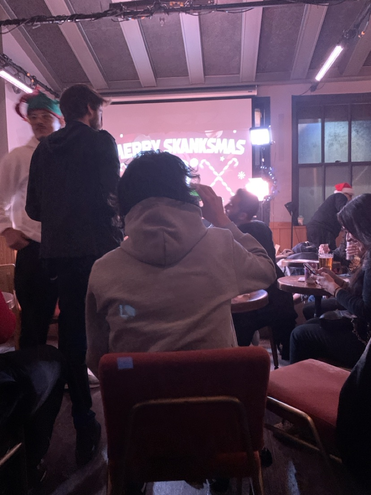
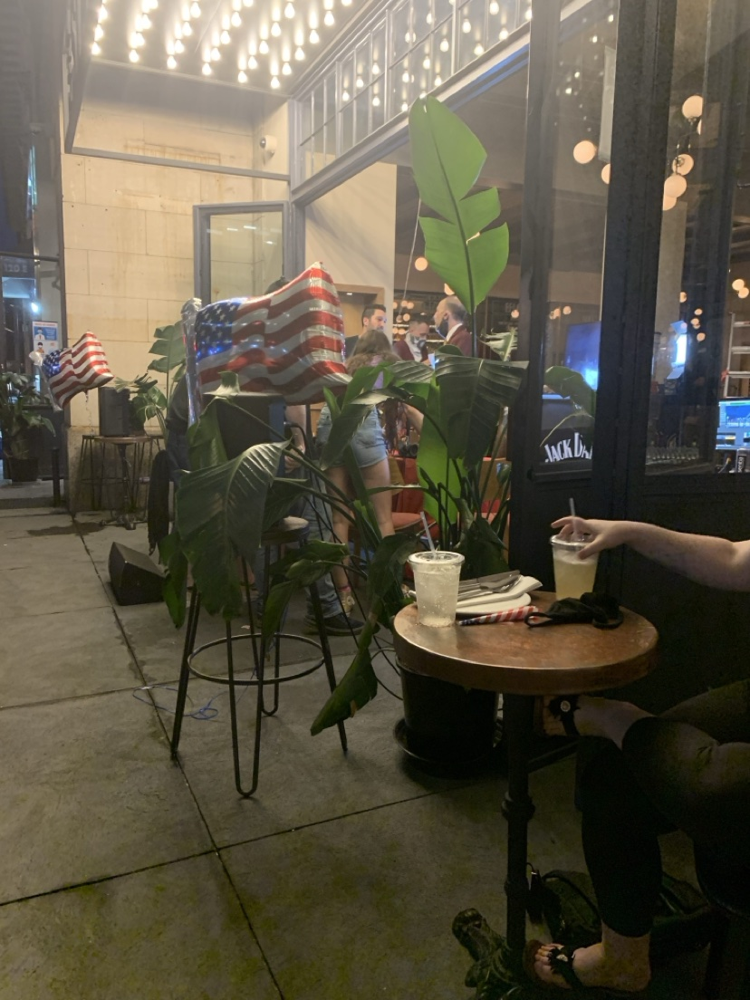

# Bobby Cole

For nine years a man in Dan Frank's Facebook inbox talked with him, almost
exclusively, about a radio show that had already ended. From **5 July 2013**
to **10 January 2022** the two of them traded clips, relitigated bits, tracked
the health and whereabouts of has-been shock jocks, and argued about comics
most people have never heard of. There is no record that they were ever in a
room together except once, in Philadelphia, in December 2018, for a taping
that Dan privately thought was bad and went to anyway.

That is the friendship. It is small and it is not dramatic and it is one of
the most useful threads in the archive, for a reason that has nothing to do
with Bobby: Dan told him things he told nobody else. The only detailed
first-person account in the entire wiki of Dan actually standing on a stage
and bombing is in this thread. So is the only account of him walking into the
SiriusXM building to ask for a job. So is the clearest dated confirmation that
his 2020 political conversion had stuck a year later. Bobby Cole is not
important to this record because of who he is. He is important because of what
Dan said to him.

## What the thread actually is, measured

The page's original figure — *"~940 messages"* — turns out to be right about a
different number than it thought. This repository does not hold the thread's
contents; it holds a machine-generated index of the Facebook archive
(`raw/facebook-threads/MANIFEST.json`, produced by `bin/wb-facebook-manifest`,
[`dat:0054`](../../kb/data/0054-facebook-archive-completed-and-recounted.md)),
and that index resolves the discrepancy exactly:

| Field | Value |
| :--- | ---: |
| Attributed messages (searchable) | **908** |
| Message blocks in the file | **941** |
| Messages from Dan | **644** |
| Messages from Bobby | **264** |
| Dan's share | **70.9%** |
| Thread file size | **133,229 bytes** |
| Years spanned | **2013 – 2022** |
| Rank among 396 parsed threads | **2nd** |

The page said `~940`; the file holds **941 message blocks**, of which 908 carry
attributable text. The gap is the archive's ordinary one — attachments,
stickers and call notices carry a timestamp and no body, and are counted
rather than guessed at
([`dat:0054`](../../kb/data/0054-facebook-archive-completed-and-recounted.md)).
So the old number was a block count and the new one is a text count, and
neither is wrong.

The rank is the finding the page never had. Against the whole Facebook
archive — 396 parsed threads, 16,238 messages, 15,923 of them searchable — the
Bobby Cole thread is **second by volume, behind one thread only**:

| Rank | Counterparty | Messages | From Dan | Dan's share | Years |
| ---: | :--- | ---: | ---: | ---: | :--- |
| 1 | Tom Maison | 5,638 | 3,193 | 56.6% | 2008–2022 |
| **2** | **Bobby Cole** | **908** | **644** | **70.9%** | **2013–2022** |
| 3 | Zachariah Harshman | 639 | 334 | 52.3% | 2011–2021 |
| 4 | Rebekah Fullem | 427 | 251 | 58.8% | 2013–2020 |
| 5 | *(unnamed counterparty)* | 421 | 421 | — | 2010–2021 |
| 6 | RJ Ritchey | 414 | 290 | 70.0% | 2019–2022 |
| 7 | Joby Anderson | 325 | 175 | 53.8% | 2015–2018 |
| 8 | Alexis Armel | 316 | 177 | 56.0% | 2017–2020 |
| 9 | Jay Lauer | 293 | 165 | 56.3% | 2016 |
| 10 | Nathan King | 285 | 180 | 63.2% | 2010–2017 |

Twenty-three threads in the archive carry 100 messages or more; the median
thread carries **three**. Bobby is one of twenty-three, and he is second.
Against [[wiki/people/tom|Tom Maison]] — the supply anchor, the fourteen-year
thread, the one relationship that outruns everything — Bobby is a sixth the
size and twice as lopsided. **Dan wrote 70.9% of it.** That is the highest
Dan-share of any thread in the archive's top ten except RJ Ritchey's, and it
is the thing to hold onto when reading what follows: this was a channel Dan
talked *into*. Bobby answered.

## 2 October 2019: the bit that died

The thread's single most valuable exchange is an account of failure, given
unprompted, in detail, to a man Dan had been trading radio clips with for six
years.

He describes the bit and he describes exactly where it went wrong:

> *"i have a bit about a hooker using my credit card to cut a line of coke and
> not realizing she was going to remember the digits on the card to buy herself
> stuff online... and i barely finished the word 'escort' before i heard
> groans."*

He names what keeps him coming back, and it is not ambition — it is a
comparison, and the comparison is deflationary:

> *"the only thing that has kept me going to open mics is one thought: 'rich
> vos AND vic henley can do this.'"*

And then, without being asked, he gives the most compact self-assessment of
his own material anywhere in the record:

> *"all of my material is just me saying a bunch of ways 'i am a drug addict
> and a failure in most endeavors' — which, i guess, is not funny in and of
> itself."*

All three quotations are relayed through the prior wiki's page and verified
stable between the old export and the corpus copy
([`dat:0159`](../../kb/data/0159-bobby-cole-nine-year-oa-friendship.md)).
Their evidential standing is covered in the appendix below, and it is not
clean.

What the passage shows, read as a human document rather than as evidence, is a
man who has done the thing and is reporting back accurately. He does not
inflate the set. He does not claim the room was wrong. He identifies the exact
syllable at which the audience turned — *escort* — which is a detail only
somebody who was standing there would produce. And his stated motivation is a
working comic's motivation rather than a fan's: Rich Vos and Vic Henley are
not aspirational figures. They are journeymen from the
[[wiki/interests/opie-and-anthony|Opie & Anthony]] orbit, and the thought that
sustains him is that if *they* can do this, the floor is lower than it looks.

In the same conversation he mentions, in passing, that he had physically
walked into **"the fishbowl"** — the SiriusXM studio — to apply for a job. He
hoped to be placed on **OutQ** rather than the *Jim and Sam* show, which he
found unbearable. No outcome for the application is recorded anywhere
([`dat:0159`](../../kb/data/0159-bobby-cole-nine-year-oa-friendship.md)).

## The same building, seven years earlier

The wiki has never put those two facts next to each other, and they belong
next to each other.

On **18 November 2012**, from New York, Dan tweeted at two O&A staffers:

> *"what's the process like to get an O&A internship? I'm a recent music
> engineering grad with pro tools certification living in NYC."*

and, the same day, *"thanks, I just sent in an app."*
([[wiki/self/twitter/2012]]). That page records it as the **only** job
application anywhere in the 2010–2012 record, notes that *"recent"* was doing
heavy lifting for a 2009 degree and a January 2010 certification, and records
no outcome.

In **October 2019** — seven years on, after the caddie years, after Uniontown,
back in New York — he walked into the same company's lobby and asked again.
Also unpaid-adjacent, also aimed at the same building, also with no recorded
outcome.

Two approaches to one institution, seven years apart, both undocumented past
the asking. The wiki's [[wiki/mind/synthesis/failure-to-launch|failure-to-launch]]
material already treats the 2012 application as the career's lowest documented
point. The 2019 walk-in is the same gesture repeated by a man with seven more
years of nothing behind him, and it is the one that is *not* filed as a career
event anywhere, because it arrived inside a message about a joke that bombed.

## December 2018: Philadelphia, and the taping that was bad

[[wiki/interests/stand-up-comedy|The stand-up page]] records, from a message to
[[wiki/people/suzanne-frank|Suz]] dated **3 December 2018**: *"We're going to
Philadelphia for a taping of a standup special."* It does not say what special.
Bobby's thread says what special, and says it twice.

On **1 December 2018** Bobby issues the invitation, and the pitch is pure
fandom shorthand — *"Nana cumia will be there... You wanna go?"* On
**8 December 2018** Dan reports back. He went. It was a **Chip Chipperson**
taping. The round trip was nine hours or more, for a sixty-five-minute set.
And he did not enjoy it:

> *"I didn't laugh once. I did crack a smile a few times... it was fucking cool
> to watch them do 'radio' after 10 years of listening to them all day
> everydayeveryday."*

Both halves of that sentence are the point. The show was bad and he says so,
privately, to the one person who would understand the cost of saying it. And
the trip was still worth it, for a reason that has nothing to do with quality:
ten years of listening, and then the thing in a room. The wiki's account of
the O&A obsession as **archive exhaustion** rather than fandom — roughly 450
watches across three fan-archive channels, the two loudest years in a
two-decade watch log, stopping rather than tapering
([[wiki/interests/opie-and-anthony]], [[wiki/mind/synthesis/closing-the-set]])
— predicts exactly this: the object was finished, and what was left was to go
and look at it.

The held corpus corroborates the trip without corroborating the message. The
quoted *"We're going to Philadelphia"* line is **not found** in
`corpus/messages.csv`; two Chip Chipperson ticket-sending rows in December 2018
are (rows 62382 and 62263, both from Dan)
([`dat:1339`](../../kb/data/1339-standup-ambition-messages-in-held-corpus.md)).
The tickets are in the primary record; the sentence about them is not.

## The complete live-comedy attendance log

Because the Bobby thread supplies two of its entries and is the only source
for one of them, the whole log is printed here rather than summarised. This is
every dated live comedy attendance the wiki holds, from every source, with the
evidence class for each:

| Date | Performer(s) / event | Place | Evidence class |
| :--- | :--- | :--- | :--- |
| 2013-08-30 | Oddball Comedy & Curiosity Festival — Dave Chappelle, Hannibal Buress, John Mulaney | Post-Gazette Pavilion, Burgettstown PA | Concert log + platform-timestamped post (22:54, *"Frogs and Katie Fletcher at #oddballcomedyfest Pittsburgh"*) + retelling — the best-evidenced night in the concert record |
| 2018-12-08 | **Chip Chipperson** taping (invited by Bobby, *"Nana cumia will be there"*) | Philadelphia | **Bobby thread only**; corroborated indirectly by two Dec 2018 ticket rows in the held corpus |
| 2019-04-29 | Chris DiStefano | New York (venue unrecorded) | Dossier attendance list (`Dan Profile.txt`, unheld) |
| 2019-10-29 | Colin Quinn | New York (venue unrecorded) | Dossier attendance list |
| 2019-10-30 | Dan Soder, Mark Normand, Rich Vos, Shane Gillis, Pete Lee, Jim Gaffigan | New York (venue unrecorded) | Dossier list + held corpus row 36932, 2019-10-31 03:00:04 UTC: *"i was at a comedy show tonight at jim gaffigan did an unannounced drop in set"* |
| 2019-11-05 | Tim Dillon, Ian Fidance | New York (venue unrecorded) | Dossier attendance list |
| 2019-11-07 | Bobby Kelly, Big Jay Oakerson | New York (venue unrecorded) | Dossier attendance list |
| 2019-11-21 | Aaron Berg, Yamaneika Saunders, Sean Patton | New York (venue unrecorded) | Dossier attendance list |
| **2019-12-23** | **Legion of Skanks — "Skanksmas" taping** | 40.735603, -73.988411 (Manhattan) | **EXIF + live GPS, iPhone XS, 21:40:36 local — primary** |
| **2020-08-25** | **Legion of Skanks — election-season outdoor taping** | 40.735631, -73.988183 (Manhattan) | **EXIF + live GPS, iPhone XS, 20:13:13 local — primary** |
| undated | Legion of Skanks — the *"gun as a dildo"* episode | unrecorded | Operator testimony only; the photo sent for it depicts a different night |

Two things fall out of printing it whole.

**First, the run does not end in November 2019.** The stand-up page's itinerary
stops at 2019-11-21 because the dossier's list stops there. The photographs
([`dat:1408`](../../kb/data/1408-legion-of-skanks-tapings-2019-12-23-2020-08-25.md))
carry it a month further, and then eight months further again, into the COVID
summer — the August 2020 frame shows an outdoor patio, flag balloons and a
mask on the table. A live comedy attendance in **August 2020** is not a
footnote to the 2019 run; it is a different era of the same habit, and it sits
four days after the 22 August 2020 self-narration that
[[wiki/mind/synthesis/2020-left-turn|the left-turn page]] dates the political
conversion to.

**Second, the evidence classes are inverted from what you would expect.** The
best-documented nights are the two nobody wrote down — the EXIF photographs,
which carry a camera, a second and a GPS fix. The worst-documented are the
club itinerary, which comes from an attendance list in an unheld dossier with
no venue attached to any date
([`dat:1341`](../../kb/data/1341-standup-comedy-page-remainder.md)). Legion of
Skanks is, in the wiki's own words, the orbit the 2019 list describes — and it
is the only part of the run with primary evidence. The venue for both
photographs is **not asserted**: the GPS fixes are consistent with the East
16th Street block and the kb node records the venue name as a proximity
inference rather than a finding
([`dat:1408`](../../kb/data/1408-legion-of-skanks-tapings-2019-12-23-2020-08-25.md)).

## 24 April 2021: the heel turn, checked eight months later

An aside in the thread does a job no other message in the corpus does. Dan
writes:

> *"i'm fully aware that i've made a big time lefty heel turn recently but i
> still think it's pretty dishonest not to"* [call out performative centrism]

— framed against his read of what 2021 conservatism amounted to:
*"basically...trump, cancel culture, and pro police."*

[[wiki/mind/synthesis/2020-left-turn|The 2020 Left Turn]] dates the conversion
to a self-narration on **22 August 2020** and attributes it to lockdown
reading and a Chapo/Hasan media pipeline. Its public corroboration is the
**3 October 2020** ultimatum tweet — *"if 2020 hasn't made you a marxist...
you're either frighteningly uninformed or just a fucking ghoul"*
([`dat:1078`](../../kb/data/1078-marxist-ultimatum-o-and-a-second-account.md)).
What it lacked was a *durability* check: a moment, well after the conversion,
where Dan describes the change in the past tense, to a friend, with no
audience and nothing to prove.

That is what this is. *"Heel turn"* is wrestling vocabulary — a face becoming a
villain — and Dan is applying it to himself, which is both self-deprecating and
precise: he is describing a change in how he reads to other people, not a
change in what he believes. Eight months after the origin date, the conversion
is settled enough to be joked about and firm enough to be argued from.

It also sits inside the one place in the record where the conversion's
*second* account lives. In July 2022 Dan told Opie directly that the O&A
fanbase's rightward drift after Anthony Cumia's 2014 firing pushed part of the
community leftward — *"we were radicalized to leftist politics"*
([`dat:1078`](../../kb/data/1078-marxist-ultimatum-o-and-a-second-account.md)).
The O&A page carries the contradiction in full: on **4 July 2014**, the day
after the firing, Dan tweeted at Cumia *"nothing but love and respect ant.
Thanks for not selling your soul through this whole mess"*
([`dat:1337`](../../kb/data/1337-opie-anthony-cumia-contradiction-and-corrections.md)).
The 2022 account's **timing** does not survive; its **direction** does. The
April 2021 message to Bobby is a waypoint on that six-year traverse, written
to somebody inside the same fanbase — which is why it reads as a check-in
rather than a declaration.

## 14 August 2021: the death that is not named

On **14 August 2021** the two share real grief over the death of a public
figure the page does not identify. Dan calls it *"literally the first
celebrity death I've ever actually cared about."*

The superlative is the fact, and it stands whoever it was about: no other
death anywhere in the corpus draws that claim from Dan. The wiki holds a
[[wiki/timeline/events/fran-death-vigil|death he attended in person]] and
narrated four ways inside forty-eight hours, and it holds no other instance of
this specific sentence. The identity is unrecorded on the page and unresearched
in the knowledge base
([`dat:0159`](../../kb/data/0159-bobby-cole-nine-year-oa-friendship.md)). It is
filed below as an open gap rather than guessed at — the thread is not held in
this repository, so the neighbouring messages that would name him cannot be
read.

## Bobby's own life, at the edges

He surfaces incidentally, which is itself a description of the friendship:

- A daughter he co-parents. An August 2020 aside references *"the first
  weekend in October"* as his custody weekend.
- A second child, born around **26 April 2021** — *"I'm legit in the hospital
  room holding my newborn."*
- A girlfriend who, by 2021, had developed a genuine interest in the O&A world
  alongside him.

That is the entire biography the record supplies for a man Dan exchanged
nine hundred messages with over nine years. He is a father twice over and a
fan, and the thread is 70.9% Dan. Whatever else was happening in Bobby Cole's
life between 2013 and 2022, this channel was not where it went.

## The five-year silence, and why it is not a fact

Between the first message of **5 July 2013** and the next dated message in
October 2018 the page records a **five-year silence**, and the page's own Gaps
section files it as a gap.

It should be read as a gap in the *export*, not a gap in the friendship, and
the reason is the governing rule of this repository rather than a hunch.
[`CORPUS_POLICY.md`](../../CORPUS_POLICY.md) exists because per-contact
fragments produce exactly this error: *"In a fragment, absence of evidence
looks exactly like evidence of absence."* The specific failure mode it names —
*"a single-handle extract shows a relationship stopping dead where it only
changed channel"* — is what a five-year hole in one Facebook thread looks like
from the inside. Over that window Dan was on iMessage in volume (the held
corpus records 13,745 messages in 2015, 20,279 in 2016, 17,550 in 2017 and
40,500 in 2018, per `corpus/derived/summary.json`), and the thread index cannot
see any of it.

So the honest statement is: **the Facebook channel is quiet between July 2013
and October 2018, and nothing establishes whether the friendship was.** The
manifest's `denominator` field says the same thing in the general case — a null
result is a null over the searchable 15,923, not over the world.

## What this page cannot show

Stated plainly, because the value of the thread is high and its evidential
standing is not.

- **The thread's contents are not in this repository.** `raw/facebook-threads/`
  holds `MANIFEST.json` and nothing else. The cited
  `.../bobbycole_-p2picui8w/message_1.html` **does not exist in this tree** —
  it is one of roughly 237 `raw/…` citations across the wiki that resolve to
  nothing after the 2026-09-08 loss (`README.md`). Every quotation on this page
  is relayed through the prior wiki's page, verified only for *stability*
  between the old export and the corpus copy
  ([`dat:0159`](../../kb/data/0159-bobby-cole-nine-year-oa-friendship.md)).
  A dangling citation is not a missing fact; it is an **unverified** one.
- **The October 2, 2019 message is absent from the held iMessage corpus.** A
  scan of all 192,140 rows for `/cut a line|credit card to cut/i` returns
  **zero**, and no hooker-bit message appears on or near 2019-10-02
  ([`dat:1340`](../../kb/data/1340-standup-only-openmic-evidence-claim-fails.md)).
  That is expected — this is a Facebook thread, not an iMessage one — but it
  means the corpus cannot be used to confirm it either.
- **The "only direct evidence" claim is withdrawn.** The stand-up page called
  this exchange *"the corpus's only direct evidence of a completed open-mic
  performance."* It is not. On **2020-03-29 03:26:54 UTC** Dan writes, in the
  held corpus, *"yeah i've had a few really good sets but it's hard to judge
  from an open mic because most of the crowd are the other comics"* (row
  32043), three minutes after *"just open mic"* (row 32055)
  ([`dat:1340`](../../kb/data/1340-standup-only-openmic-evidence-claim-fails.md)).
  The exchange remains the **fullest** account of a set; it is not the only one.
  The connections block above has been corrected accordingly.
- **The SiriusXM application's outcome is unrecorded.** As is the 2012
  internship application's. Neither is known to have been answered; neither is
  known to have been refused.
- **The August 2021 death is unidentified**, and cannot be identified without
  the thread body.
- **The ~940 / 908 question is settled and the settlement is small.** It was a
  counting-method difference, not a discrepancy about what happened.
- **Bobby Cole's current circumstances are not recorded.** The thread ends
  10 January 2022. Nothing after that date mentions him.

## Appendix: evidence status, claim by claim

Kept compact and at the bottom, per the wiki's own rule that the human story
leads and the forensics follow.

| Claim | Class | Standing |
| :--- | :--- | :--- |
| Thread exists, 908 msgs / 941 blocks, 644 from Dan, 2013–2022 | Measurement | **High** — `raw/facebook-threads/MANIFEST.json`, generated by tooling that imports its pattern from the search it feeds ([`dat:0054`](../../kb/data/0054-facebook-archive-completed-and-recounted.md)) |
| Second-largest thread in the archive | Measurement | **High** — derived from the same manifest, 396 threads sorted |
| Oct 2, 2019 open-mic quotations | Relayed testimony | **Moderate** — stable across old export and corpus copy; absent from the held iMessage corpus; source file missing from `raw/` |
| SiriusXM walk-in, "the fishbowl", OutQ | Relayed testimony | **Moderate** — same provenance as above; no outcome recorded |
| 2012-11-18 O&A internship application | Relayed testimony | **Moderate** — quoted on [[wiki/self/twitter/2012]]; the tweet archive is not held here |
| Dec 2018 Chip Chipperson taping | Relayed testimony + indirect primary | **Moderate** — invite and report relayed; two Dec 2018 ticket rows found in the held corpus ([`dat:1339`](../../kb/data/1339-standup-ambition-messages-in-held-corpus.md)) |
| "We're going to Philadelphia for a taping" | Relayed testimony | **Low** — **not found** in the held corpus ([`dat:1339`](../../kb/data/1339-standup-ambition-messages-in-held-corpus.md)) |
| Apr 24, 2021 "lefty heel turn" | Relayed testimony | **Moderate** — consistent with two independently dated public self-accounts ([`dat:1078`](../../kb/data/1078-marxist-ultimatum-o-and-a-second-account.md)) |
| Aug 14, 2021 "first celebrity death" | Relayed testimony | **Moderate** as a superlative; the referent is **unknown** |
| Bobby's two children, girlfriend | Relayed testimony | **Low** — single-source, incidental, unverifiable here |
| Legion of Skanks tapings, 2019-12-23 and 2020-08-25 | Primary | **High** — genuine capture EXIF with live GPS ([`dat:1408`](../../kb/data/1408-legion-of-skanks-tapings-2019-12-23-2020-08-25.md)) |
| Legion of Skanks "gun as a dildo" attendance | Operator testimony | **Moderate**, unphotographed — recorded at L3 as an interpretation, not a datum, because a sourceless datum is a belief |
| Five-year Facebook silence, 2013–2018 | Non-observation | **Not a finding** — a null over one channel, per [`CORPUS_POLICY.md`](../../CORPUS_POLICY.md) |

## Sources

*2019-12-23 21:40:36 local — Legion of Skanks live taping, "MERRY SKANKSMAS"
on the screen behind the table, indoor room. iPhone XS, live GPS fix
40.735603, -73.988411. Discussed above in the live-comedy log: this is the
first of the two attendances that carry primary evidence, and it extends the
2019 club run a month past where the dossier itinerary stops. Venue name is not
asserted.*
`src:legion-of-skanks-tapings-photos-2019-12-23-2020-08-25`,
sha256 `0432a40b…`

---

*2020-08-25 20:13:13 local — Legion of Skanks election-season taping, outdoors:
flag balloons, a COVID-era patio, a mask on the table. iPhone XS, live GPS fix
40.735631, -73.988183, fifteen metres from the December 2019 fix. Discussed
above: a live comedy attendance in the COVID summer, four days after the
22 August 2020 self-narration that dates the political conversion — the same
habit, a different era, and the only evidence that the run survived 2019.*
`src:legion-of-skanks-tapings-photos-2019-12-23-2020-08-25`,
sha256 `dcc0ec19…`
