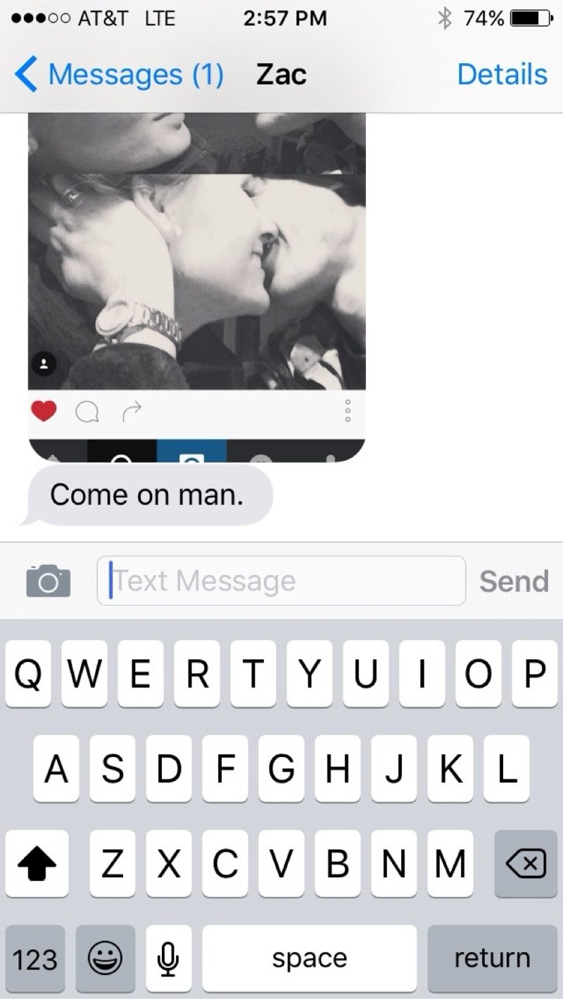
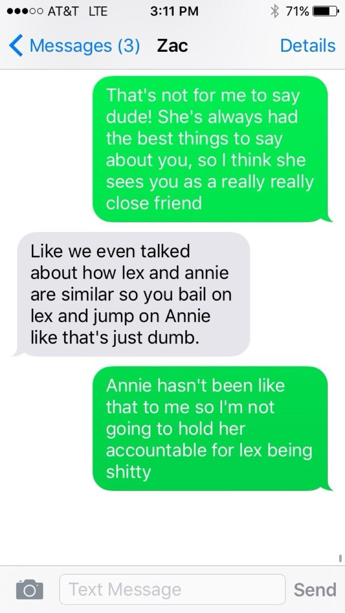
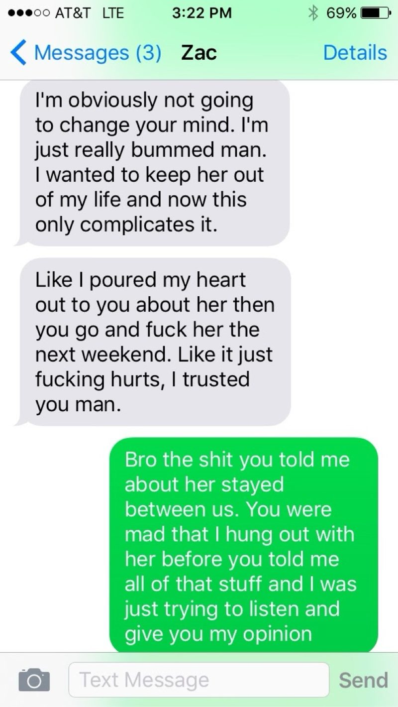
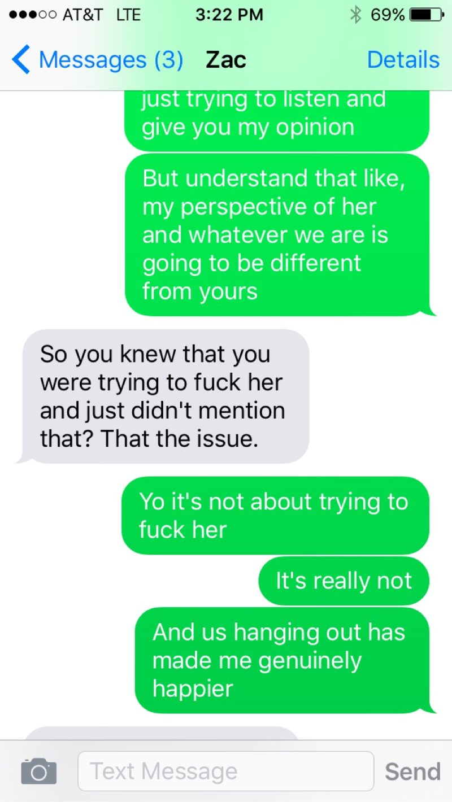
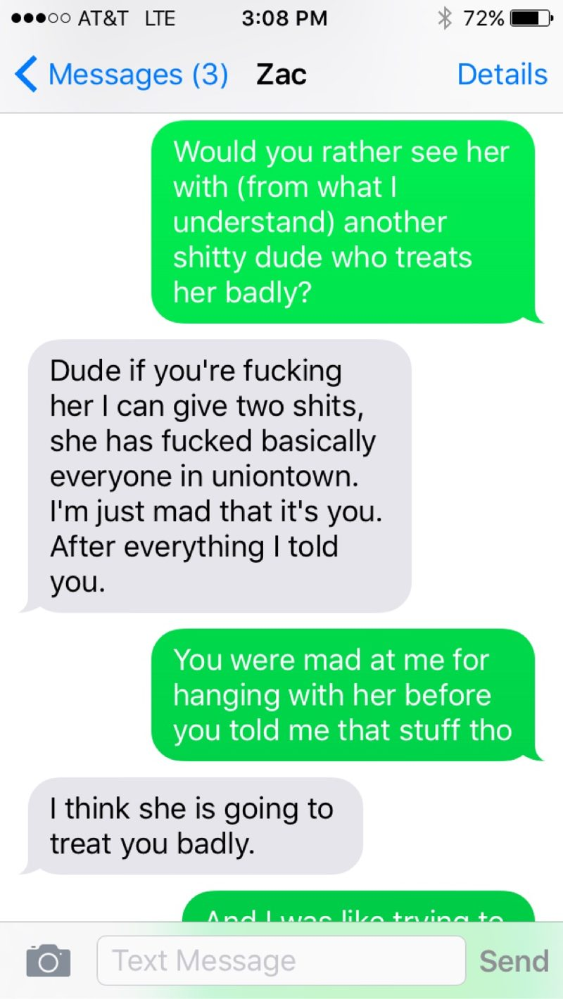
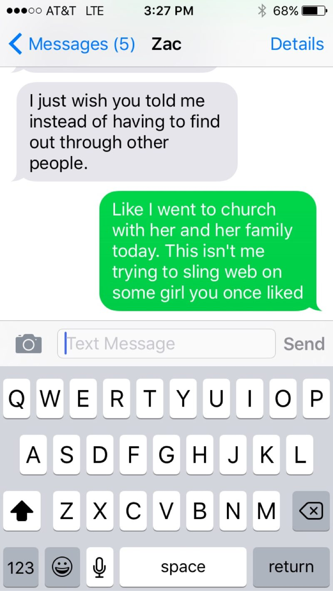
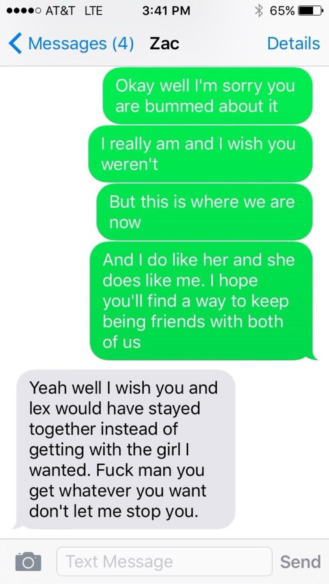

# Zac Shumar

Zac Shumar is the Uniontown man who — in the space of a decade — dated Dan
Frank's sister, lost his virginity to Annie Ulmer, argued with Dan over both
women, dated Alexis Armel, and lived with Dan and Annie while doing it. He is
the switch's third pole: not an observer but a man with his own claim on
Annie, which is what makes his testimony about it unusually sharp.

**Identity.** The contact "Zac" in the December 2015 screenshots is **Zac
Shumar** — Dan's identification, 2026-09-12, authoritative and overriding the
intake brief, which had tentatively attributed the thread to Zach Clingan.
The two Zachs are distinct: Shumar's argument with Dan is dated December 6,
2015 by EXIF; Clingan's "I have to talk to you" intervention is December 9
(see [[wiki/people/zach-clingan|Zach Clingan]]). They are three days apart,
not the same afternoon.

## The backstory

Dan's account, given 2026-09-12 and partially attested in his own 2026-08-19
message to Ally Lubin (messages.csv row 231518):

- Shumar was **Vanessa Frank's first boyfriend** — the 2026-08-19 phrasing is
  "dated my sister for 3 years in high school."
- He **lost his virginity to Annie**.
- He started hanging around right as the December 2015 switch happened —
  the December 6 argument below is the record of that — and **dated Alexis
  after the breakup**.

The virginity claim has no 2015-era primary source; it is Dan's testimony
(two attestations, same speaker, 2026-08-19 and 2026-09-12). The CATO
bootloader's ambiguous line that Shumar was "also Annie's first" — previously
quarantined in dat:0247 for having no primary source — is now Dan-sourced in
this direction (Annie was *his* first), but the quarantine's rationale for
contemporaneous records stands.

## December 6, 2015: the confrontation

On Sunday, December 6, 2015, from 2:57 to 3:41 PM ET, Shumar argued with Dan
by text about Dan taking Annie. Four of the seven screenshots carry EXIF
(14:57:51, 15:11:14, 15:22:10, 15:41:35); the interstitial frames are dated by
adjacency. This is the sole record — distinctive lines return zero hits in
messages.csv and the iMessage dump.

The exchange, in order:

- **2:57 PM.** Shumar sends an Instagram screenshot of an unidentified
  kissing couple, captioned "Come on man."
- **3:08 PM.** Dan: "Would you rather see her with (from what I understand)
  another shitty dude who treats her badly?" Shumar: "Dude if you're fucking
  her I can give two shits, she has fucked basically everyone in uniontown.
  I'm just mad that it's you. After everything I told you." Dan: "You were
  mad at me for hanging with her before you told me that stuff tho." Shumar:
  "I think she is going to treat you badly."
- **3:11 PM.** Dan: "That's not for me to say dude! She's always had the
  best things to say about you, so I think she sees you as a really really
  close friend." Shumar: **"Like we even talked about how lex and annie are
  similar so you bail on lex and jump on Annie like that's just dumb."** Dan:
  "Annie hasn't been like that to me so I'm not going to hold her accountable
  for lex being shitty."
- **3:22 PM.** Shumar: "I'm obviously not going to change your mind. I'm
  just really bummed man. I wanted to keep her out of my life and now this
  only complicates it." / "Like I poured my heart out to you about her then
  you go and fuck her the next weekend. Like it just fucking hurts, I trusted
  you man." Dan: "Bro the shit you told me about her stayed between us. You
  were mad that I hung out with her before you told me all of that stuff and
  I was just trying to listen and give you my opinion."
- **3:22 PM, cont.** Dan: "But understand that like, my perspective of her
  and whatever we are is going to be different from yours." Shumar: "So you
  knew that you were trying to fuck her and just didn't mention that? That
  the issue." Dan: "Yo it's not about trying to fuck her / It's really not
  / And us hanging out has made me genuinely happier."
- **3:27 PM.** Shumar: "I just wish you told me instead of having to find
  out through other people." Dan: **"Like I went to church with her and her
  family today. This isn't me trying to sling web on some girl you once
  liked."**
- **3:41 PM.** Dan: "Okay well I'm sorry you are bummed about it / I really
  am and I wish you weren't / But this is where we are now / And I do like
  her and she does like me. I hope you'll find a way to keep being friends
  with both of us." Shumar: "Yeah well I wish you and lex would have stayed
  together instead of getting with the girl I wanted. Fuck man you get
  whatever you want don't let me stop you."

Three things matter here:

1. **The switch gets named by an outsider, in real time.** "You bail on lex
   and jump on Annie" is a third party independently describing the single
   bond transfer eight days into the documented record. This is the
   [[wiki/mind/synthesis/bond-switch-2015|single-bond switch]] as other
   people saw it.
2. **Shumar was not a neutral warning voice.** He wanted Annie himself —
   "the girl I wanted" — had poured his heart out to Dan about her, and felt
   betrayed: "then you go and fuck her the next weekend. Like it just fucking
   hurts, I trusted you man." The "I wanted to keep her out of my life"
   line gains later structural weight: he subsequently lived, with Alexis, in
   Dan and Annie's house.
3. **The switch was already public.** "Having to find out through other
   people" means the relationship was circulating in Uniontown gossip by
   December 6 — Dan's own family-integration pitch ("I went to church with
   her and her family today") was being made *defensively*, to a friend he'd
   already lost the narrative with. Dec 6 was a Sunday; the church claim is
   weekday-consistent with the EXIF dating (the 3:27 PM frame itself carries
   no EXIF and is dated by adjacency — noted, not smoothed).

Four days later the argument's reality is corroborated in-corpus: on Dec 10,
Dan texts Annie "Could have used shumar's PA system but he didn't get back
from philly in time" and "Also he's still mad at me" (messages.csv rows
131957, 131914).

### Where it sits in the sequence

Dec 1: "we made it." Dec 5: the stolen-laptop night. **Dec 6: Shumar
confronts Dan; Dan claims church with Annie's family.** Dec 9: Clingan's
intervention. Dec 10: the marriage exchange and the onset of the message
flood. The Shumar confrontation is the week-one third-party cost of the
switch, made visible.

## The house fire and the month

Dan's 2026-09-12 account: after Shumar started dating Alexis, **their house
burned down, and they moved in with Dan and Annie for about a month.** This
grounds the bootloader's "new boyfriend in tow" month (Annie page: Alexis
stayed with Dan and Annie "roughly a month afterward with a new boyfriend in
tow") and is consistent with the contemporaneous Lucas Thomas thread, which
opens February 11, 2017 with the news that Lex's place had caught fire.

**Unresolved:** the bootloader places the stay immediately after the
November 2015 breakup; the fire thread dates the fire to February 11, 2017.
These are either two separate stays (a ~Dec 2015 month and a ~Feb 2017
month) or one misdated account. Both are preserved; neither is picked.

## Valentine's Day 2017: the bust

On February 14, 2017, Zac went to collect a mail-order marijuana shipment
and walked into staged police. The contemporaneous account is Lucas Thomas's
Facebook thread (opened Feb 11 with the fire news; Feb 16 with the granular
account): Zac picking up mail at a man named RT's house, RT having been
around people who "may or may not have been getting government salaries,"
**fifteen officers** staged to swarm when he took the package (read by both
men as a likely informant tip), bail at **$35,000 each**, a glass rig Zac had
loaned Lucas seized with everything else in Zac's car, and Zac's parents
learning about the arrest and the house fire in the same jail phone call.

The legal aftermath, from Dan's later retellings: Zac hired paid counsel;
the DA required all three defendants to accept the same plea; Alexis — "it
legit wasn't her deal" — took it; within about a month she failed a drug
test, violated probation, and was jailed around the end of October 2017; by
April 2018 she was at **SCI Muncy**; Zac did no time. Dan's verdict to Tom in
August 2018: "She honestly got a bad break… She stayed loyal to Zac," and
Zac "got a good lawyer and fucked her over."

**Friction, preserved.** Dan's 2026-09-12 testimony puts the shipment at
**20 lbs**; his 2018 retellings (to New Jim Shaffer in April, and in the
thread-transcription) put it at **ten pounds from California**. The date,
mechanism, arrests, bail, lawyer, plea structure, and SCI Muncy all agree
across accounts; the weight is the single numerical contradiction, kept as
one.

## Afterward

The friendship outlasted the case: Dan and Zac were collaborating on an
apparel side project in October 2017 while Alexis was on probation, and in
July 2022 Dan was still close enough to report "a 5 hour argument with Zac
Shumar" about politics. The corpus carries Shumar in the margins through
December 2016 ("Shumar is still here and meeting someone," "I'm walking to
Shumar," "Me him and Shumar we're playing music lol") and once, late: on
August 30, 2026, Annie texted Dan "Zac Shumar's dad died."

## Corrections

- **CORRECTED [2026-09-12]:** the intake brief tentatively framed these
  screenshots as Dan's half of the December 9, 2015 Clingan intervention.
  EXIF refutes it — this thread is December 6, and the contact is Zac
  Shumar, not Zach Clingan. The brief's same-afternoon claim is superseded;
  the sequence above replaces it.
- The 20-lb / 10-lb shipment weight is an unresolved contradiction between
  Dan's 2026 testimony and his 2018 retellings, not a correction.

## Sources

Screenshots received 2026-09-12 (direct send from Dan); originals local-only.

