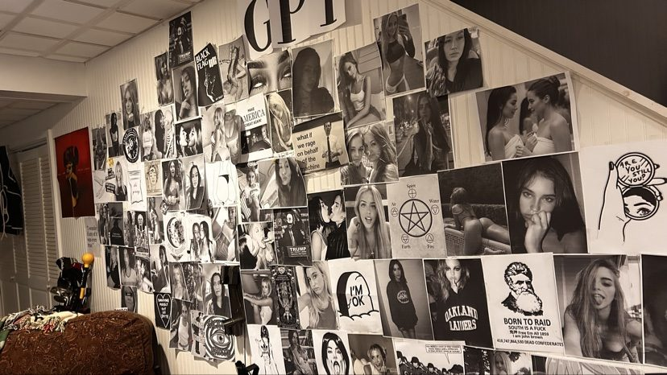

# Attraction Guide (instrument suite)

The attraction guide is Dan's deployed instrument suite for mapping what
he finds attractive — live at <https://danfr4nk.github.io/attraction-guide/>
(repo `Danfr4nk/attraction-guide`; pushes go through the Git Data API, no
local git repo). A splash page indexing the whole suite went live
2026-09-12 (commit `c798ca6`): cards for the Diagnostic, Telemetry Lab,
Scenario Ratings, Scenario Telemetry, and Face Book; the game itself
moved to `/game.html`.

**The instruments:**

- **Diagnostic (game v2)** — the staged A/B portrait game: adaptive
  drill-down, metric-grounded evidence per pick, uncertainty-based axis
  queue, pair-validity auto-exclusion, confound flagging; phase-2 pairs
  show optional per-feature A/B rows per materially-different metric
  (|z| ≥ 0.5).
- **Telemetry Lab** (`telemetry.html`) — ~40-metric MediaPipe face
  vector; v2 added image-quality refusal gates, iris-anchored mm scale,
  contour areas, offline solvePnP 3D twin; the JS port cross-validated
  27/27 against the Python reference.
- **Scenario Ratings** (`scenario-rate.html`) — v2 is the causal
  single-knob design: every modifier changes exactly one metric vs its
  base (168 modifiers, deterministic rotation, each metric perturbed
  6–8x); readout is causal knob-effect deltas. Supersedes v1's
  correlational readout (see the scenario-ratings profile page).
- **Scenario Telemetry** (`scenario.html`) — named preset picker
  (foursome / her ex / she watches / 2019 baseline); phase 1 = preset
  bouts, phase 2 = metric isolation.
- **Face Book** (`face-book.html`) — the browsable catalog of the
  155-face library (32 phase-1, 111 phase-2 variants, 12 anchors).
- **Frame Describe** (`frame-describe.html`) — live 2026-09-12: an
  open-ended, exhaustive frame/body description tool, deliberately not
  precision-based. Provider-agnostic — bring your own vision API key
  (stored in localStorage), per-run custom instructions.

## 2026-09-13 Telemetry Lab methodology corrections

On 2026-09-13 Dan ran an improvement pass over the Telemetry Lab and it
turned into an audit — the kind where the instrument confesses. The changes:

- **Pose, decomposed.** The face transformation matrix was broken out into
  explicit pitch/yaw/roll instead of one opaque transform, so pose effects
  can be read off directly instead of hiding inside a black-box matrix.
- **"Bootstrap" renamed.** The resampling step was called a bootstrap; it
  wasn't one. It's landmark-noise jitter now — the new name says what the
  code actually does, and stops laundering a statistical claim the
  instrument never earned.
- **Honest uncertainty.** The Wilson score interval display was corrected
  to show its real states: n=0 and n<4 now render as what they are —
  no-data and thin-data — instead of drawing confident-looking intervals
  over nothing.
- **Ethnicity selector from the actual bank.** The selector is populated
  from the face library's real groups now, not a generic list that implied
  coverage the bank doesn't have.
- **Geometry in pixel space, roll-corrected.** Landmark geometry moved to
  pixel space with roll-corrected canthal tilt — the tilt metric no longer
  inherits head-roll as if it were facial structure.
- **The heavy tail was the detector.** The phase-1 adiposity "heavy tail"
  — the thing that looked like a real distributional finding about his
  preferences — traced to a detector artifact. After the fix the reported
  SD collapsed 0.0364 → 0.0155. The actual remaining confound moved to the
  phase-2 jaw-soft variants, where it belongs.

Harness: 55/55 checks green after the pass. Still open: the JS drift audit
is blocked pending harness infrastructure. The JS port's 27/27
cross-validation against the Python reference (noted above) predates these
corrections — the port needs re-validation against the corrected lab.

The through-line is the one Dan keeps enforcing: audit the instrument, then
trust it. A preference-mapping pipeline that can't tell you when its own
detector is lying to it isn't measuring Dan — it's measuring itself.
Evidence: `dat:1505-telemetry-lab-methodology-corrections-20260913`.

## The Frame Describe lexicon v0.1

The tool runs on Dan's own descriptive register, committed 2026-09-12
after the assistant trawled 99k of his outbound texts for body-descriptor
vocabulary and reported an honest thin result — the attested hits
("frame," "perfect body," "nice tits," "juicy ass") couldn't carry an
instrument, so the lexicon came from Dan's supplied terms instead:

- Subject noun: **"girl"**
- Lead line grammar: `[hair] [single defining trait] girl`
- **"titties"** — cup size always estimated, never hedged
- **"babyfat"** — soft stomach
- **"tats"** — never "tattoos"; ink coverage in degrees
  ("360° neck tats," "full sleeves")
- Output sections, in order: **lead / body inventory / ink inventory /
  face report / aura** — the aura being "the major visual and
  psychosexual theme in her aura"

This is the first committed record of his descriptive vocabulary for
women's bodies — the earlier attested body terms ("frame," "jelly,"
"mogged," "perfect," "delicious," "juicy," "nice") remain valid but were
never organized into an instrument grammar.

Evidence: `dat:1462-frame-describe-lexicon-20260912`
(source: `src:sammy-chat-transcript-20260912-1940`).

## The Wall (August 2025): the analog predecessor

A year before any of this instrumentation existed, Dan built the same
impulse out of paper. Over Aug 1–2, 2025 he covered a basement wall with
dozens of printed black-and-white women's portraits, interspersed with
text and graphic prints — a "GPT" banner, a BLACK FLAG-style logo, a
tarot/occult poster (pentagram with elemental correspondences), "I'M OK,"
an OAKLAND RAIDERS shirt graphic, "BORN TO RAID / EST. 1960," a
hand-drawn "ARE YOU...?" graphic, a roast-joke picture bottom-left
("boom fuckin roasted dude"), and what he called "a fucking brand new
deja reference." He photographed it 2025-09-03 at 04:42 on his iPhone 14
— a month after construction, so the surviving photo is a later document
of the Wall, not its creation moment. Every portrait subject is
unidentified; no nudity or sexual activity is visible.

What the Wall was *for* is stated outright in the contemporaneous texts.
At 2025-08-03 00:38 he told Tom Maison: "we need to show kristin my wall
of despair to get her take." Then, at 00:39: "SHE NEEDS TO SEE THE WALL
TOM" / "THE WALL IS ALL I HAVE NOW" / "well milo, and the wall." The
collection was an evaluation device from the start — built to be judged,
by one specific woman. On Aug 26 he sent Kristin a photo of it while
wearing a shirt reading CUMSLUT and asked Tom whether that was good or
bad news ("the big beautiful wall of pain"). Tom's suggestion on Aug 5 —
"You should put a picture of Kristin on your wall" — landed while Dan
didn't even know her last name ("YOU WON'T EVEN TELL ME HER LAST NAME").
The Wall predates his first direct contact with Kristin (Aug 29, per the
Kristin timeline) by nearly four weeks: he built a shrine of women's
faces *for* a woman he had never spoken to, with Tom as the intermediary
who knew her.

The through-line to the instrument suite is curatorial, and it is the
same gesture at two fidelities: collect women's faces into an organized
display to systematize what he finds attractive. In 2025 the display is
physical, built for one woman's take; in 2026 it is the 155-face digital
library with a 40-metric telemetry vector and a formal A/B game. The
Wall's stated purpose already frames the collection as something to be
*evaluated* — which is exactly what the diagnostic game later
formalizes. Nothing about the Wall exists anywhere in the wiki before
this intake; it lived only in the August 2025 texts until Dan sent the
photo on 2026-09-12 captioned "The famous 'wall' from the pre Kristin
summer 2025 era" — pointing, a year later, at the origin story of the
curation instinct the whole suite now runs on.

<!-- INLINE-KEEP (thumbnail rule 2026-09-12): the Wall photo is the object of analysis for this entry — the Wall itself is the entry's subject. Do not migrate to Sources thumbnails. -->

One false lead, cleared: "he decorated that whole wall himself he was
super specific about what he wanted" (Aug 5, 02:26) is a deadpan 2 AM
joke about Milo the dog wanting a king bed — the "he" is the dog, not a
second builder and not a second wall.

Evidence: `dat:wall-built-20250801-02`, `dat:wall-purpose-kristin-take`,
`dat:wall-contents-per-texts-20250803`, `dat:wall-cumslut-photo-20250826`,
`dat:wall-milo-joke-false-lead-20250805`,
`dat:wall-tom-kristin-picture-suggestion`,
`dat:wall-photo-exif-20250903`, `dat:wall-photo-visual-read`
(sources: `src:imessage-corpus-2026`, `src:wall-photo-2025-09-03`).
Pattern: `pat:wall-as-analog-face-library`.
See also: [Kristin Prentiss](wiki/people/kristin.md).
